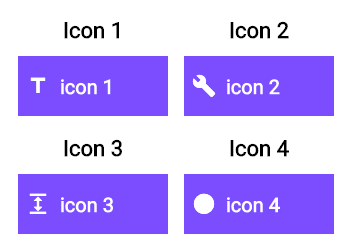

## NvGolden
### init()
The init method must be called in the setUpAll callback to load the fonts. Otherwise your screenshots will contain black squares instead of readable text. 

### device()
The `NvGolden.device(...)` constructor takes a list of `Screen` Objects. You can create your own or use the ones provided in `Device`.

### grid()
The `NvGolden.grid(...)` constructor takes a nrColumns argument specifying the number of columns for your golden file. You can pass in one global `Screen` Object or have each `Scenario` with it's own `Screen`. 

### addScenario()
The `addScenario(...)` method is the place where all the magic happens. Pass in a name and the widget you want to test and you are good to go.

## TL;DR
The following test shows you pretty much everything there is to know. 
```void main() {
  setUpAll(loadAppFonts);

  testWidgets('test widget with universal screen size in 2x2 grid',
      (tester) async {
    final smallDevice = Screen(size: Size(150, 60));

    final nvGolden = NvGolden.grid(nrColumns: 2, screen: smallDevice)
      ..addScenario(
        name: 'Title',
        widget: nvWrapper.wrap(
          SampleIconButton(
            text: 'Title',
            icon: Icons.title,
          ),
        ),
      )
      ..addScenario(
        name: 'Circle',
        widget: nvWrapper.wrap(
          SampleIconButton(
            text: 'Circle',
            icon: Icons.circle,
          ),
        ),
      );

    await tester.createGolden(nvGolden, 'icon_button_universal_size');
  });
}
```

It produces the following screenshot/golden:


## Google Fonts Support
The google_fonts plugin unfortunately does not yet provide a method to await loading the fonts during testing and is therefore not compatible with this plugin. Should the method ever be added to google_fonts simply call it alongside `NvGolden.init()` in the setUpAll method. 